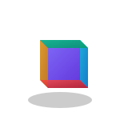

# 
👋 Hi, I'm <a href="https://github.com/notcaliper">notcaliper</a>

<!-- Animated Waving Hand GIF in Intro -->

  

<!-- Gradient Animated Banner -->

  

<!-- Animated Gradient Text -->

  

<!-- Multi-Wave Animation (Main Divider) -->

  
  
  

---

## 🧑‍💻 About Me

> "Building the future, one line of code at a time."

  

I'm a passionate developer and open-source contributor with a focus on **AI, blockchain, IoT, smart contracts, and computer vision**. My projects span JavaScript, TypeScript, Python, and HTML, and I love building innovative solutions that bridge the gap between emerging tech and real-world applications.

- 🔭 Currently exploring: **AI, Web3, and IoT**
- 🛠️ Tech Stack: Python, JavaScript, TypeScript, React, Node.js, Docker, AWS, and more
- 🌱 Always learning: Machine Learning, Blockchain, Smart Contracts
- 💡 Fun fact: I code while chatting with friends!

### 🌟 Key Skills

  

    AI/ML:
    
  

  
  

    Full Stack:
    
  

  
  

    Blockchain:
    
  

<!-- Blob Divider for Variety -->

## 🤝 Let's Connect

  
  
  
  

---

## 🌈 Philosophy

> "Code is not just about solving problems, it's about creating possibilities."

## 🛠️ Tech Stack

  

  <!-- Languages -->
  <h3>💻 Languages</h3>
  

    <table>
      <tr>
        <td align="center" width="100" height="100" style="background: rgba(59, 130, 246, 0.1); border-radius: 10px; padding: 10px;">
          
           
          <b>Python</b>
        </td>
        <td align="center" width="100" height="100" style="background: rgba(247, 223, 30, 0.1); border-radius: 10px; padding: 10px;">
          
           
          <b>JavaScript</b>
        </td>
        <td align="center" width="100" height="100" style="background: rgba(0, 122, 204, 0.1); border-radius: 10px; padding: 10px;">
          
           
          <b>TypeScript</b>
        </td>
        <td align="center" width="100" height="100" style="background: rgba(227, 79, 38, 0.1); border-radius: 10px; padding: 10px;">
          
           
          <b>HTML5</b>
        </td>
        <td align="center" width="100" height="100" style="background: rgba(67, 43, 140, 0.1); border-radius: 10px; padding: 10px;">
          
           
          <b>Solidity</b>
        </td>
      </tr>
    </table>
  

  <!-- Frameworks & Libraries -->
  <h3>🧩 Frameworks & Libraries</h3>
  

    <table>
      <tr>
        <td align="center" width="100" height="100" style="background: rgba(97, 218, 251, 0.1); border-radius: 10px; padding: 10px;">
          
           
          <b>React</b>
        </td>
        <td align="center" width="100" height="100" style="background: rgba(51, 153, 51, 0.1); border-radius: 10px; padding: 10px;">
          
           
          <b>Node.js</b>
        </td>
        <td align="center" width="100" height="100" style="background: rgba(6, 182, 212, 0.1); border-radius: 10px; padding: 10px;">
          
           
          <b>OpenCV</b>
        </td>
      </tr>
    </table>
  

  <!-- Tools & Platforms -->
  <h3>🔧 Tools & Platforms</h3>
  

    <table>
      <tr>
        <td align="center" width="100" height="100" style="background: rgba(44, 165, 224, 0.1); border-radius: 10px; padding: 10px;">
          
           
          <b>Docker</b>
        </td>
        <td align="center" width="100" height="100" style="background: rgba(255, 153, 0, 0.1); border-radius: 10px; padding: 10px;">
          
           
          <b>AWS</b>
        </td>
        <td align="center" width="100" height="100" style="background: rgba(228, 76, 48, 0.1); border-radius: 10px; padding: 10px;">
          
           
          <b>Git</b>
        </td>
        <td align="center" width="100" height="100" style="background: rgba(0, 120, 212, 0.1); border-radius: 10px; padding: 10px;">
          
           
          <b>VSCode</b>
        </td>
      </tr>
    </table>
  

  <!-- Hardware & IoT -->
  <h3>🤖 Hardware & IoT</h3>
  

    <table>
      <tr>
        <td align="center" width="100" height="100" style="background: rgba(0, 200, 200, 0.1); border-radius: 10px; padding: 10px;">
          
           
          <b>Arduino</b>
        </td>
        <td align="center" width="100" height="100" style="background: rgba(51, 51, 51, 0.1); border-radius: 10px; padding: 10px;">
          
           
          <b>Linux</b>
        </td>
      </tr>
    </table>
  

---

<!-- Typing Animation for Section Header -->

  

  
  

<table class="project-cards">
  <tr>
    <td align="center" width="320px" class="project-card" style="border-radius: 16px; box-shadow: 0 4px 15px rgba(0,0,0,0.1); transition: transform 0.3s, box-shadow 0.3s; overflow: hidden;">
      <a href="https://github.com/notcaliper/HandGaze">
         
        AI-powered computer vision tool for real-time hand gesture recognition and digital communication.
      </a>
    </td>
    <td align="center" width="320px" class="project-card" style="border-radius: 16px; box-shadow: 0 4px 15px rgba(0,0,0,0.1); transition: transform 0.3s, box-shadow 0.3s; overflow: hidden;">
      <a href="https://github.com/notcaliper/ASEP-AIDS">
         
        IoT-based smart irrigation system with ESP32 and real-time management for agriculture.
      </a>
    </td>
  </tr>
  <tr>
    <td align="center" width="320px" class="project-card" style="border-radius: 16px; box-shadow: 0 4px 15px rgba(0,0,0,0.1); transition: transform 0.3s, box-shadow 0.3s; overflow: hidden;">
      <a href="https://github.com/notcaliper/python-parking">
         
        Computer vision-based parking management system with automated license plate detection.
      </a>
    </td>
    <td align="center" width="320px" class="project-card" style="border-radius: 16px; box-shadow: 0 4px 15px rgba(0,0,0,0.1); transition: transform 0.3s, box-shadow 0.3s; overflow: hidden;">
      <a href="https://github.com/notcaliper/Form-Generate-script">
         
        Open-source Python script for dynamic form generation. MIT licensed.
      </a>
    </td>
  </tr>
  <tr>
    <td align="center" width="320px" class="project-card" style="border-radius: 16px; box-shadow: 0 4px 15px rgba(0,0,0,0.1); transition: transform 0.3s, box-shadow 0.3s; overflow: hidden;">
      <a href="https://github.com/notcaliper/YoLED">
         
        Experimental project. (No public description)
      </a>
    </td>
    <td align="center" width="320px" class="project-card" style="border-radius: 16px; box-shadow: 0 4px 15px rgba(0,0,0,0.1); transition: transform 0.3s, box-shadow 0.3s; overflow: hidden;">
      <a href="https://github.com/notcaliper/notcaliper.github.io">
         
        Personal/project website (JavaScript).
      </a>
    </td>
  </tr>
  <tr>
    <td align="center" width="320px" class="project-card" style="border-radius: 16px; box-shadow: 0 4px 15px rgba(0,0,0,0.1); transition: transform 0.3s, box-shadow 0.3s; overflow: hidden;">
      <a href="https://github.com/notcaliper/notcaliper">
         
        Miscellaneous utilities and experiments.
      </a>
    </td>
    <td></td>
  </tr>
</table>

---

## 📊 GitHub Analytics

  
  
  

---

  

---

<!-- Instructions for enabling animations -->

<b>✨ How to enable all animations</b>

For the full animated experience, make sure you have the following files in your <code>assets</code> folder:

<ul>
  <li><code>wave-hand.gif</code> - Animated waving hand</li>
  <li><code>wave-top-animated.svg</code> - Top wave divider</li>
  <li><code>wave-bottom-animated.svg</code> - Bottom wave divider</li>
  <li><code>multi-wave-animated.svg</code> - Multi-layered wave animation</li>
  <li><code>blob-divider-animated.svg</code> - Morphing blob divider</li>
  <li><code>animated-gradient-text.svg</code> - Gradient animated text</li>
  <li><code>animated-sparkle.svg</code> - Sparkle animation</li>
  <li><code>tech-stack-title.svg</code> - Animated tech stack title</li>
  <li><code>skill-bar-animated.svg</code> - Animated skill progress bars</li>
  <li><code>rotating-cube.svg</code> - 3D rotating cube animation</li>
  <li><code>typing-animation.svg</code> - Typing effect animation</li>
</ul>

All SVG files have been created and are part of this repository. Just use them as shown in the README.

