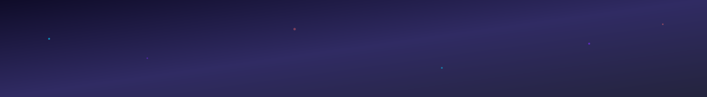

<div align="center">

# ⚡ notcaliper

<a href="https://git.io/typing-svg"></a>

<br/>

[](https://linkedin.com/in/notakshay)
[](https://github.com/notcaliper)
[](https://notcaliper.dev)
[](mailto:notcaliper@gmail.com)
[](https://twitter.com/notcaliper)

</div>


##  About Me

```yaml
name: notcaliper
location: Earth 🌍
current_focus: "AI × Web3 × IoT"
motto: "Turning ideas into impact, through code."

roles:
  - Full Stack Developer
  - AI & ML Engineer
  - Blockchain Developer
  - IoT Architect

currently_building:
  - 🧠 Decentralized identity systems with biometric + blockchain integration
  - 🤖 Self-learning drones with computer vision
  - 🌐 Smart contracts for real-world applications
  - 🌱 IoT-powered agricultural automation

fun_fact: "My best ideas spark during late-night debug sessions ☕🌙"
```


## 🛠️ Tech Arsenal

<div align="center">

**Languages & Frameworks**


**Tools & Infrastructure**


**Specialized**


</div>


## 🏆 GitHub Trophies

<div align="center">
  
  <br/>
  <sub><i>If trophies don't load, <a href="https://github.com/ryo-ma/github-profile-trophy">refresh</a> — the service can be slow sometimes.</i></sub>
</div>


## 🚀 Featured Projects

<div align="center">
<table>
  <tr>
    <td align="center" width="50%">
      <a href="https://github.com/notcaliper/HandGaze">
        <br/>
        <sub><b>AI-powered hand gesture recognition & digital communication</b></sub>
      </a>
    </td>
    <td align="center" width="50%">
      <a href="https://github.com/notcaliper/ASEP-AIDS">
        <br/>
        <sub><b>Smart irrigation system with ESP32 & real-time management</b></sub>
      </a>
    </td>
  </tr>
  <tr>
    <td align="center" width="50%">
      <a href="https://github.com/notcaliper/python-parking">
        <br/>
        <sub><b>Automated license plate detection & parking management</b></sub>
      </a>
    </td>
    <td align="center" width="50%">
      <a href="https://github.com/notcaliper/Form-Generate-script">
        <br/>
        <sub><b>Dynamic form generation script — open source & MIT licensed</b></sub>
      </a>
    </td>
  </tr>
  <tr>
    <td align="center" width="50%">
      <a href="https://github.com/notcaliper/YoLED">
        <br/>
        <sub><b>Experimental IoT/Raspberry Pi project</b></sub>
      </a>
    </td>
    <td align="center" width="50%">
      <a href="https://github.com/notcaliper/notcaliper.github.io">
        <br/>
        <sub><b>Personal portfolio & project showcase website</b></sub>
      </a>
    </td>
  </tr>
</table>
</div>


## 📊 GitHub Analytics

<div align="center">
  
  
</div>

<br/>

<div align="center">
  
</div>

<br/>

<div align="center">
  
</div>


## 🐍 Contribution Snake

<div align="center">
  <picture>
    <source media="(prefers-color-scheme: dark)" srcset="https://raw.githubusercontent.com/notcaliper/notcaliper/output/github-contribution-grid-snake-dark.svg">
    <source media="(prefers-color-scheme: light)" srcset="https://raw.githubusercontent.com/notcaliper/notcaliper/output/github-contribution-grid-snake.svg">
    
  </picture>
</div>


<div align="center">

  

  <br/><br/>

  **⭐ Star my repos if you find them useful! ⭐**

  

</div>
