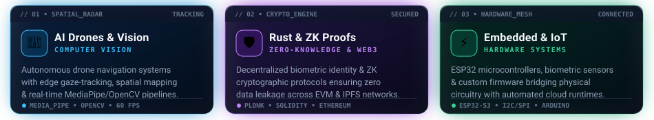

<div align="center">

  <!-- Main Glassmorphism Header Banner -->
  

  <br/><br/>

  <!-- Dynamic Typing SVG Banner -->
  <a href="https://readme-typing-svg.demolab.com">
    
  </a>

  <br/><br/>

  <!-- Quick Social & Contact Badges -->
  <a href="https://linkedin.com/in/notakshay"></a>
  <a href="https://github.com/notcaliper"></a>
  <a href="https://notcaliper.dev"></a>
  <a href="mailto:akshaymanbhaw27@gmail.com"></a>

</div>

<br/>

<!-- Glass Divider -->


<br/>

## 👨‍💻 About Me

```
┌─────────────────────────────────────────────────────────────────────────────┐
│  ENGINEER @ INTERSECTION OF AI • BLOCKCHAIN • IOT                           │
└─────────────────────────────────────────────────────────────────────────────┘
```

> *"Turning complex ideas into seamless code & hardware systems."*

I am a full-stack engineer and hardware builder specializing in **Computer Vision**, **Zero-Knowledge Web3 Architectures**, and **Embedded IoT Systems**. My work focuses on building autonomous systems that bridge physical hardware with intelligent software—ranging from gesture-controlled drones to biometric decentralized identities.

- 🌍 **Based in:** Earth
- 🔭 **Current Focus:** AI-driven drone navigation & ZK cryptography
- ⚡ **Fun Fact:** I debug with `console.log` and `printf` with zero regrets.

<br/>

<!-- Glass Divider -->


<br/>

## ⚡ Current Focus & Active Radar



<br/>

<!-- Glass Divider -->


<br/>

## 🛠️ Technical Stack & Arsenal

<div align="center">

### **Languages & Core**
<code> Python</code> &nbsp;
<code> C++</code> &nbsp;
<code> Rust</code> &nbsp;
<code> TypeScript</code> &nbsp;
<code> JavaScript</code> &nbsp;
<code> Solidity</code> &nbsp;
<code> Embedded C</code>

<br/><br/>

### **AI, ML & Computer Vision**
<code> OpenCV</code> &nbsp;
<code> TensorFlow</code> &nbsp;
<code> PyTorch</code> &nbsp;
<code> FastAPI</code> &nbsp;
<code> NumPy</code>

<br/><br/>

### **Web Frameworks & Databases**
<code> React</code> &nbsp;
<code> Next.js</code> &nbsp;
<code> Node.js</code> &nbsp;
<code> Tailwind</code> &nbsp;
<code> PostgreSQL</code> &nbsp;
<code> MongoDB</code>

<br/><br/>

### **Blockchain & Web3**
<code> Ethereum</code> &nbsp;
<code> IPFS</code> &nbsp;
<code> Hardhat</code> &nbsp;
<code> Ethers.js</code>

<br/><br/>

### **IoT & Systems**
<code> Arduino</code> &nbsp;
<code> Raspberry Pi</code> &nbsp;
<code> Docker</code> &nbsp;
<code> Git</code> &nbsp;
<code> Linux</code>

<br/>

[](https://linkedin.com/in/notakshay)
[](https://github.com/notcaliper)
[](https://notcaliper.dev)
[](mailto:akshaymanbhaw27@gmail.com)

</div>

<br/>

## 🏆 GitHub Trophies

<div align="center">
  
</div>

<br/>

<!-- Glass Divider -->


<br/>

## 📦 Featured Engineering Projects

<div align="center">

| Project | Description | Tech Stack |
| :--- | :--- | :--- |
| 🚁 **[HandGaze](https://github.com/notcaliper/HandGaze)** | AI-powered gesture & eye-tracking controller for autonomous drone flight navigation. | `Python` `OpenCV` `MediaPipe` `IoT` |
| 🛡️ **[TrueID](https://github.com/notcaliper/TrueID)** | Decentralized identity platform integrating biometric verification with Ethereum smart contracts. | `Solidity` `React` `IPFS` `Ethers.js` |
| 🌐 **[ASEP-AIDS](https://github.com/notcaliper/ASEP-AIDS)** | AI Security & Intrusion Detection system leveraging real-time edge computer vision streams. | `Python` `TensorFlow` `FastAPI` |
| 🅿️ **[python-parking](https://github.com/notcaliper/python-parking)** | Automated smart parking management system powered by license plate detection & occupancy tracking. | `Python` `OpenCV` `SQLite` |
| 🔍 **[TrueView](https://github.com/Desapphire/TrueView)** | Decentralized deepfake detection and digital content provenance verification platform. | `Python` `Deep Learning` `Web3` |
| 📦 **[lost-found](https://github.com/notcaliper/lost-found)** | Campus asset recovery platform with image matching & automated notification pipelines. | `TypeScript` `React` `Node.js` |

<br/>

### 🌟 Project Repositories Spotlight

<a href="https://github.com/notcaliper/HandGaze">
  
</a>
<a href="https://github.com/notcaliper/TrueID">
  
</a>

<br/><br/>

<a href="https://github.com/notcaliper/ASEP-AIDS">
  
</a>
<a href="https://github.com/notcaliper/python-parking">
  
</a>

<br/><br/>

<a href="https://github.com/Desapphire/TrueView">
  
</a>
<a href="https://github.com/notcaliper/lost-found">
  
</a>

</div>

<br/>

<!-- Glass Divider -->


<br/>

## 📊 Analytics & Developer Insights

<div align="center">

  
  

  <br/><br/>

  
  

  <br/><br/>

  

</div>

<br/>

<!-- Glass Divider -->


<br/>

## 🐍 Contribution Snake Grid

<div align="center">
  <picture>
    <source media="(prefers-color-scheme: dark)" srcset="https://raw.githubusercontent.com/notcaliper/notcaliper/output/github-snake-dark.svg">
    <source media="(prefers-color-scheme: light)" srcset="https://raw.githubusercontent.com/notcaliper/notcaliper/output/github-snake.svg">
    
  </picture>
</div>

<br/>

<!-- Glass Divider -->


<br/>

<!-- Footer Glassmorphism Card -->


<br/>

<div align="center">

  

  <br/><br/>

  <sub>Designed &amp; Architected with 💙 by <a href="https://github.com/notcaliper">Akshay (@notcaliper)</a></sub>

</div>
